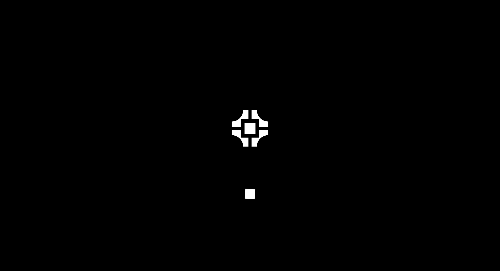
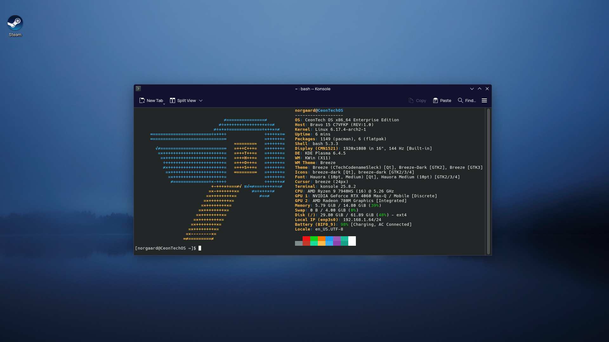

# CeonTech OS Cutting Edge [EXPERIMENTAL]

CeThOS CutEdge (CeonTech OS Cutting Edge) is a Linux distribution based on Arch Linux, mainly focuses on latest updates with Arch packages and pre-installed with productivity softwares for artists. This version is still experimental. 
 

## Philosophy
CeonTech OS Cutting Edge likes simplicity and user-friendly for newcomers to use Linux distribution based on Arch that keeps you the latest updates and encouraging productivity by using free and open-source apps targeted for artists who would like to break free from paid softwares depedency. 
 

## Note
> [!WARNING]
> This Linux distribution is still experimental. Use it at your own risk.

> Known Issues
*  SDDM is not configured autologin in the live ISO
*  Calamares is not available yet

> [!IMPORTANT]
> It is best to report the bug as soon as possible for quick changes with the build.
 

## Image Preview

  
   
  <b>Splash Screen of CeonTech OS</b>

 

  
   
  <b>Old Preview of CeonTech OS</b> 
  <i>Was planned to be an enterprise operating system</i>

## System Requirements

CeonTech OS system requirements does not need to be fancy to operate. However, modern laptops are recommended to operate CeonTech OS for smooth experience during usage.

| Hardware | Minimum | Recommended |
| :--- | :--- | :--- |
| **Processor** | Intel Core i3 Gen 5 | AMD Ryzen 5 3600 |
| **GPU** | AMD Vega 3 | Nvidia GeForce MX230 |
| **RAM** | 8 GB | 16 GB |
| **Storage** | 60 GB Free Space | 256 GB Free Space |
| **Display** | 1366 x 768 | 1920 x 1080 |
| **Architecture** | x86_64 | x86_64 |
